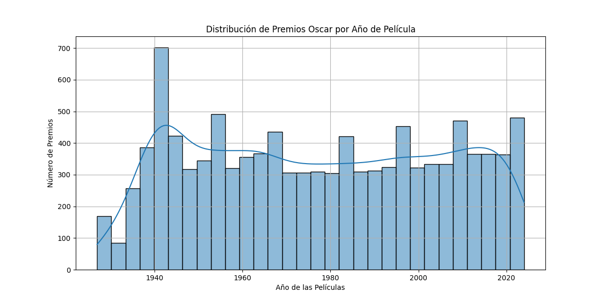
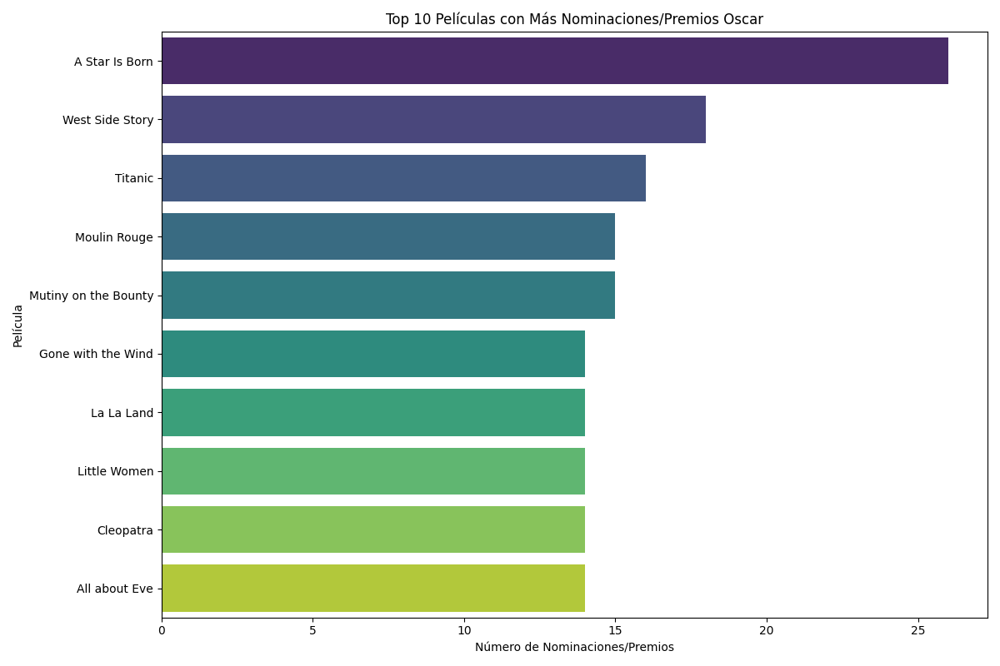
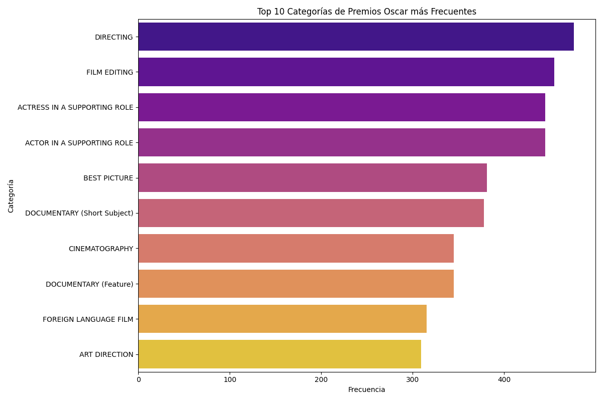

# Análisis Exploratorio de Datos (EDA) - Premios Oscar

Este proyecto realiza un análisis exploratorio de datos sobre un conjunto de datos de los Premios Oscar. El objetivo es limpiar los datos, analizarlos para extraer información valiosa y visualizar los hallazgos clave para comprender mejor la historia y las tendencias de los premios.

## Resumen de Hallazgos y Observaciones

El análisis se realizó sobre el archivo `the_oscar_award.csv`. Los pasos principales fueron:

1.  **Carga de Datos**: Se cargaron los datos y se realizó una revisión inicial de su estructura.
2.  **Limpieza y Transformación**:
    *   Se eliminaron las filas con valores nulos en las columnas `name` y `film`, ya que son cruciales para el análisis.
    *   Se eliminaron espacios en blanco innecesarios en las columnas de texto.
    *   Se eliminaron registros duplicados para asegurar la calidad de los datos.
3.  **Análisis Exploratorio (EDA)**: Se calcularon estadísticas descriptivas para variables numéricas y categóricas, y se generó un informe detallado con `ydata-profiling`.
4.  **Visualización**: Se crearon gráficos para comunicar los hallazgos de manera efectiva.

## Visualizaciones Importantes

Las siguientes visualizaciones resumen las tendencias más importantes encontradas en los datos:

### 1. Distribución de Premios por Año de Película

Este histograma muestra cómo se ha distribuido el número de premios a lo largo del tiempo. Se puede observar un aumento en la cantidad de categorías y premios otorgados en las ceremonias más recientes.



### 2. Top 10 Películas Más Premiadas

Este gráfico de barras muestra las 10 películas que han recibido más nominaciones o premios a lo largo de la historia de los Oscar, destacando los filmes más exitosos.



### 3. Top 10 Categorías de Premios Más Frecuentes

Este gráfico de barras ilustra las categorías que han aparecido con más frecuencia en los premios, lo que nos da una idea de cuáles son las áreas más consistentemente reconocidas por la Academia.



## Justificación de Alertas del Reporte EDA

El informe generado por `ydata-profiling` (`oscar_eda_report.html`) muestra algunas alertas de alta correlación entre variables:

-   `ceremony` es altamente correlacionada con `year_ceremony`.
-   `year_ceremony` es altamente correlacionada con `ceremony`.
-   `year_film` es altamente correlacionada con `ceremony`.

**Justificación para no resolver estas alertas:**

Estas correlaciones son **esperadas y lógicas** debido a la naturaleza de los datos.

-   El **número de la ceremonia** (ej. 93ª) está directamente ligado al **año en que se celebra** (`year_ceremony`). Son, en esencia, dos formas de medir el mismo evento cronológico.
-   El **año de la película** (`year_film`) es, por naturaleza, muy cercano al año de la ceremonia, ya que las películas suelen ser premiadas al año siguiente de su estreno.

Eliminar estas variables resultaría en la pérdida de información contextual y cronológica importante. Dado que no representan un problema de calidad de datos ni afectan negativamente los objetivos de este análisis exploratorio, se decidió conservarlas.

## Conclusiones

El análisis exploratorio nos permitió obtener una visión clara de la historia de los Premios Oscar. La limpieza de datos fue fundamental para garantizar la fiabilidad de los resultados. Las visualizaciones revelaron patrones interesantes, como el crecimiento en el número de premios a lo largo del tiempo y la dominancia de ciertas películas y categorías.

Este análisis sienta las bases para investigaciones más profundas y específicas.

## Próximos Pasos

Basado en este análisis, los siguientes pasos podrían ser:

1.  **Análisis por Género**: Investigar si ciertos géneros cinematográficos tienen más probabilidades de ganar en determinadas categorías.
2.  **Análisis de Actores/Directores**: Explorar qué actores, actrices o directores han sido más premiados.
3.  **Modelado Predictivo**: Construir un modelo de machine learning que intente predecir los ganadores de futuras ceremonias basándose en las características de las películas.

## Cómo Ejecutar el Proyecto

Para replicar este análisis, sigue estos pasos:

1.  **Clonar el Repositorio**:
    ```bash
    git clone <URL-DEL-REPOSITORIO>
    cd <NOMBRE-DEL-DIRECTORIO>
    ```

2.  **Instalar Dependencias**:
    Asegúrate de tener Python y pip instalados. Luego, instala las librerías necesarias:
    ```bash
    pip install -r requirements.txt
    ```

3.  **Ejecutar el Script**:
    ```bash
    python main.py
    ```

4.  **Revisar los Resultados**:
    *   Se generará el informe `oscar_eda_report.html` en la raíz del proyecto.
    *   Las visualizaciones se guardarán en la carpeta `visualizations/`.

